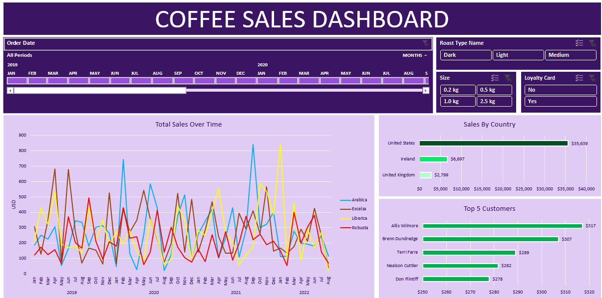

# Coffee Orders Project  

## Overview  
This project analyzes coffee orders to uncover insights using dynamic visualizations and a streamlined dataset.  

## Features  
- **Data Cleaning**:  
  - Merged data from three sheets: `Orders`, `Customers`, and `Products`.  
  - Added columns for **Customer Name**, **Email**, and **Country** using `VLOOKUP`.  
  - Dynamically populated **Coffee Type**, **Roast Type**, and other attributes using `INDEX` and `MATCH`.  

- **Interactive Dashboard**:  
  - Purple-themed visualizations with slicers and timelines.  
  - Users can filter data by time periods for precise analysis.  

## Dashboard Preview  
  

## Tools & Techniques  
- **Excel**: For cleaning, formula-driven dynamic updates, and creating interactive dashboards.  

## Visuals  
- Dynamic sales trends, top customers, and product performance, all at a glance.  
